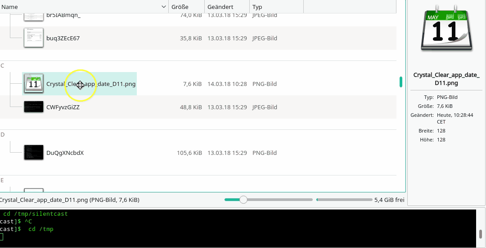

# Installation

## Plasma 5 (KDE)

Copy the .sh file, and the .desktop file to your User-Based KDE-ServiceMenu Path:

`~/.local/share/kservices5/ServiceMenus/`

Then run `kbuildsycoca5` on CLI, or restart your Plasma session.

# How to use

